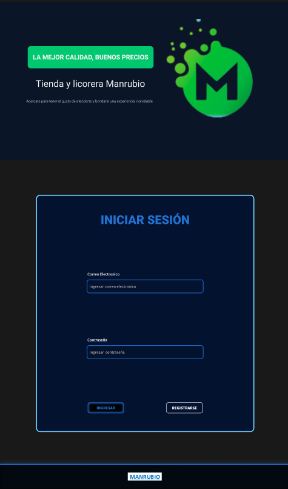
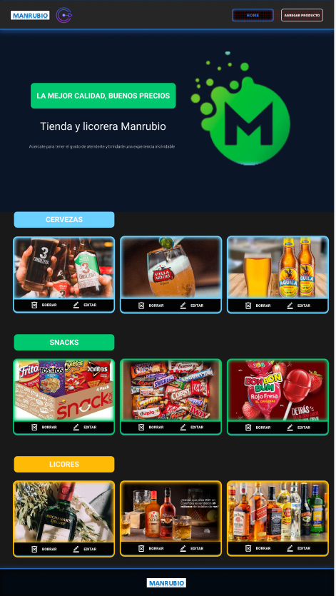

# Tienda Licorera

¡Bienvenido al proyecto **Tienda Licorera**! Proyecto desarrollado utilizando Tailwind, Astro, MySQL, Node, Cloudinary, Express y TypeScript.

## Previsualización 

### Registro


### Login


### Productos


## Requisitos

- **Docker**: Asegúrate de tener Docker instalado en tu máquina. Puedes encontrar [instrucciones de instalación aquí](https://www.docker.com/products/docker-desktop).

## Instrucciones para Ejecutar el Proyecto

1. **Clonar el Repositorio:**

   ```bash
   git clone https://github.com/Aventuraweb/Tienda-Licorera


2. **Ejecutar en consola:**

  cd final
  docker-compose up --build

El backend se abrirá en localhost:3000
El frontend se abrirá en localhost:4321

## Para la base de datos se trabajo con Docker con las siguientes tablas 

```CREATE TABLE IF NOT EXISTS usuarios (
    id INT NOT NULL AUTO_INCREMENT PRIMARY KEY,
    nombre_usuario VARCHAR(100) NOT NULL,
    correo VARCHAR(100) NOT NULL UNIQUE,
    password VARCHAR(100) NOT NULL
);```

```CREATE TABLE IF NOT EXISTS categorias (
    idcategoria INT NOT NULL AUTO_INCREMENT PRIMARY KEY, 
    nombre_categoria VARCHAR(100) NOT NULL
);```

```CREATE TABLE IF NOT EXISTS productos (
    idproducto INT NOT NULL AUTO_INCREMENT PRIMARY KEY,
    nombre_producto VARCHAR(100) NOT NULL,
    precio DECIMAL(10, 2) NOT NULL,
    image_url VARCHAR(255) NOT NULL, 
    idcategoria INT NOT NULL
);```

Las imagenes se generan desde cloudinary con el link de cada imagen 

